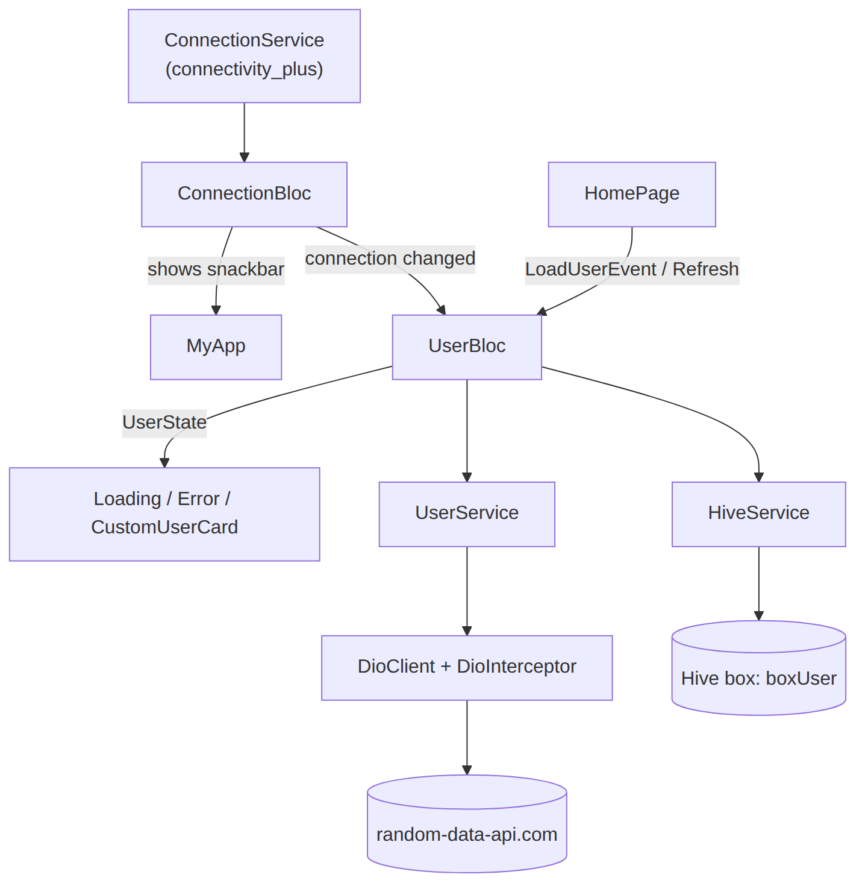
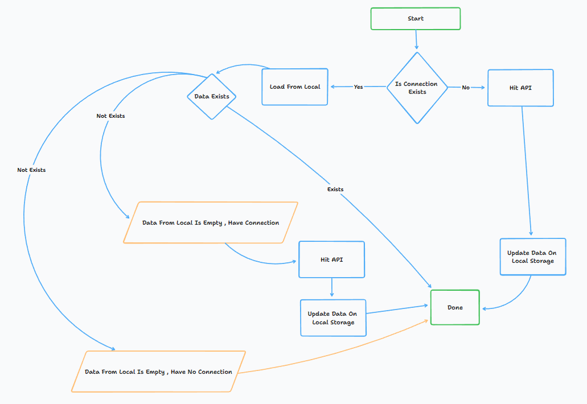
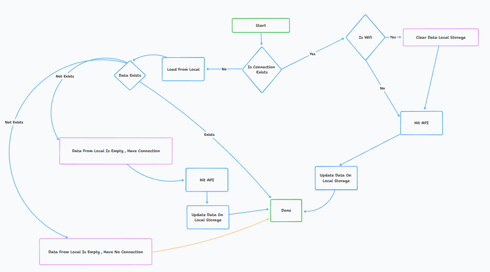

# Random User: Offline-First Flutter App with BLoC & Hive

A Flutter app that fetches a random user from the
[Random Data API](https://random-data-api.com/) and shows their avatar and username.
The project shows an **offline-first** pattern: the user is cached on the device with
**Hive**, and the app decides whether to use the cache or call the API based on the
device's **network connection** (Wi-Fi, mobile data or none).

It is a small reference project for:

- **BLoC** state management (`flutter_bloc`)
- **Offline caching** with Hive and generated type adapters
- **Connectivity monitoring** with live updates (`connectivity_plus`)
- **Networking** with Dio and a logging interceptor
- A **layered architecture**: UI → BLoC → services → API / local database

## Demo

https://github.com/PwS/random_user/assets/22534596/61b6f67e-ee5b-4fa6-a94f-69cf328c32e9

The video is also in the repo at [`doc/demo/demo-vid.mp4`](doc/demo/demo-vid.mp4).

## Table of contents

- [Features](#features)
- [Tech stack](#tech-stack)
- [Getting started](#getting-started)
- [Project structure](#project-structure)
- [Architecture](#architecture)
- [How data flows](#how-data-flows)
- [API](#api)
- [Local database (Hive)](#local-database-hive)
- [Code generation](#code-generation)
- [Testing](#testing)

## Features

- Shows a random user's **avatar** and **username**.
- **Caches** the user on the device, so the app still works without internet after the first load.
- **Listens for connection changes** and shows a snackbar ("Connect To Wifi", "Connect To Mobile", …).
- **Refreshes automatically** when the connection changes:
  - on **Wi-Fi** it clears the cache and fetches a new user;
  - on **mobile data** it keeps the cached user to save data;
  - with **no connection** it shows the cached user, or a "No Connection" screen with a **Refresh** button.
- Logs every request and response (Dio interceptor), and every BLoC event and state change (`AppBlocObserver`).
- Locked to **portrait** orientation.

## Tech stack

| Package | Version | Used for |
| --- | --- | --- |
| [Flutter](https://flutter.dev/) / Dart | Dart `>=3.0.3 <4.0.0` | UI framework |
| [flutter_bloc](https://pub.dev/packages/flutter_bloc) | ^8.1.3 | State management (BLoC pattern) |
| [equatable](https://pub.dev/packages/equatable) | ^2.0.5 | Value equality for models, events and states |
| [dio](https://pub.dev/packages/dio) | ^5.2.1 | HTTP client |
| [hive](https://pub.dev/packages/hive) / [hive_flutter](https://pub.dev/packages/hive_flutter) | ^2.2.3 / ^1.1.0 | Local NoSQL database (cache) |
| [connectivity_plus](https://pub.dev/packages/connectivity_plus) | ^4.0.1 | Detects Wi-Fi / mobile / no connection |
| [flutter_secure_storage](https://pub.dev/packages/flutter_secure_storage) | ^8.0.0 | Secure key storage (set up for future tokens, not used yet) |
| [build_runner](https://pub.dev/packages/build_runner) + [hive_generator](https://pub.dev/packages/hive_generator) | ^2.4.5 / ^2.0.0 | Generates the Hive type adapters (dev only) |
| [flutter_lints](https://pub.dev/packages/flutter_lints) | ^2.0.0 | Lint rules (dev only) |

## Getting started

### Prerequisites

- [Flutter SDK](https://docs.flutter.dev/get-started/install) 3.10 or newer (the first release with Dart 3)
- An Android emulator, iOS simulator or physical device
  (the app also builds for web, Windows, macOS and Linux)

Check your setup with:

```bash
flutter doctor
```

### Install and run

```bash
git clone https://github.com/PwS/random_user.git
cd random_user
flutter pub get
flutter run
```

To pick a specific device, use `flutter devices` to list them and then run `flutter run -d <device-id>`.

### Build a release

```bash
flutter build apk --release        # Android APK
flutter build appbundle --release  # Android App Bundle (Play Store)
flutter build ios --release        # iOS (needs macOS + Xcode)
```

## Project structure

```text
lib/
├── main.dart                         # Entry point: Hive init, BlocObserver, portrait lock, connection snackbars
├── db/
│   └── db_hive/
│       ├── box_name.dart             # Hive box names
│       └── database_hive.dart        # Hive init + adapter registration
├── models/
│   └── user/
│       ├── user.dart                 # User model (+ user.g.dart generated adapter)
│       ├── address/                  # Address
│       ├── coordinates/              # Coordinates (lat/lng)
│       ├── credit_card/              # CreditCard
│       ├── employment/               # Employment
│       └── subscription/             # Subscription
├── service/
│   ├── config/
│   │   ├── dio_client.dart           # Dio wrapper (base options, GET/POST helpers)
│   │   └── dio_interceptor.dart      # Logs requests, responses and errors
│   ├── connection/                   # ConnectionService: current status + change stream
│   ├── local_database/hive/          # HiveService: read / save / clear the cached user
│   └── user/                         # UserService: fetch a user from the API
├── state_management/
│   ├── connection/                   # ConnectionBloc: event, state, bloc
│   └── user/                         # UserBloc: event, state, bloc
├── ui/
│   ├── home/home_page.dart           # Home screen: loading / error / user card
│   └── custom_widget/                # Reusable widgets (CustomUserCard)
└── utils/
    └── bloc_observer.dart            # Logs all BLoC events, changes and errors
doc/
├── architecture/                     # Architecture diagram (+ Mermaid source)
├── flow/                             # Flow diagrams (OnLoad, OnRefresh)
└── demo/                             # Demo video
```

Every service has an abstract `Base…Service` class with a concrete implementation
(for example `BaseUserService` → `UserService`). The services are singletons, and the
abstract classes make them easy to replace with mocks in tests.

## Architecture



The diagram source is [`doc/architecture/architecture.mmd`](doc/architecture/architecture.mmd).
After editing it, regenerate the image with:

```bash
npx @mermaid-js/mermaid-cli -i doc/architecture/architecture.mmd -o doc/architecture/architecture.png -s 2 -b white
```

**ConnectionBloc** (created in `main.dart`, above `MaterialApp`)
- Subscribes to `ConnectionService.listenGetStatus()`, which wraps `Connectivity().onConnectivityChanged`.
- Every change emits a new `ConnectionState(currentConnection)`.
- A `BlocListener` in `MyApp` shows a snackbar for each change.

**UserBloc** (created in `HomePage`)

| Event | When it fires | What it does |
| --- | --- | --- |
| `LoadUserEvent` | When the home page opens | Loads the user (see [On load](#on-load)) |
| `RefreshUserEvent(connectionResult)` | On every `ConnectionBloc` state change, and when **Refresh** is tapped | Reloads the user (see [On refresh](#on-refresh)) |

| State | What the UI shows |
| --- | --- |
| `UserLoading` | A progress spinner |
| `UserLoadedState(user)` | `CustomUserCard` with the avatar and username |
| `UserErrorState('No Internet')` | "No Connection" and a **Refresh** button |
| `UserErrorState(other)` | "Failed Load User Caused By …" and a **Refresh** button |

## How data flows

### On load



When the app starts, `UserBloc` handles `LoadUserEvent`:

1. Read the cached user from Hive.
2. If the cache is **empty** and there is **no connection**, emit `UserErrorState('No Internet')`.
3. If the cache **has a user**, emit it straight away.
4. Otherwise, fetch a user from the API, save it to Hive and emit it.

### On refresh



When the connection changes or the user taps **Refresh**, `UserBloc` handles `RefreshUserEvent`:

1. Emit `UserLoading`.
2. If the connection is **Wi-Fi**, clear the Hive cache so a new user is fetched.
3. Then follow the same steps as **On load**: use the cache if it has a user, show "No Internet"
   if it is empty and offline, or fetch from the API and save to Hive.

So on **mobile data** the cached user is kept to save data, and on **Wi-Fi** you get a new
random user each time.

> The diagrams show the intended design. In the code, the cache is always checked first on
> load, even when the device is online.

## API

| | |
| --- | --- |
| Base | `https://random-data-api.com/api/` |
| Endpoint | `GET https://random-data-api.com/api/v2/users` |
| Auth | None |
| Docs | <https://random-data-api.com/documentation> |

Example response (shortened):

```json
{
  "id": 1234,
  "uid": "6c9a5e1c-...",
  "password": "...",
  "first_name": "Jane",
  "last_name": "Doe",
  "username": "jane.doe",
  "email": "jane.doe@email.com",
  "avatar": "https://robohash.org/...png?size=300x300&set=set1",
  "gender": "Female",
  "phone_number": "...",
  "social_insurance_number": "...",
  "date_of_birth": "1990-01-01",
  "employment": { "title": "...", "key_skill": "..." },
  "address": { "city": "...", "street_name": "...", "street_address": "...", "zip_code": "...",
               "state": "...", "country": "...", "coordinates": { "lat": 0.0, "lng": 0.0 } },
  "credit_card": { "cc_number": "..." },
  "subscription": { "plan": "...", "status": "...", "payment_method": "...", "term": "..." }
}
```

`DioClient` settings:
- JSON headers.
- Connect and receive timeouts of **1 minute** each.
- `validateStatus` accepts every status code, so `UserService` checks for `200` itself.
- Dio errors are rethrown as a plain `Exception`, which the BLoC turns into a `UserErrorState`.

## Local database (Hive)

- **Box:** `boxUser` (defined in `BoxName.boxUser`). The user is stored with `user.id` as the key.
- **Init:** `DatabaseHive.initHive()` runs in `main()` before `runApp`. It calls
  `Hive.initFlutter()` and registers every adapter.

### Hive TypeIDs

Each Hive model needs a **unique, permanent** `typeId`:

| Model | TypeID |
| --- | --- |
| `User` | 0 |
| `Employment` | 1 |
| `Address` | 2 |
| `CreditCard` | 3 |
| *(unused)* | 4 |
| `Subscription` | 5 |
| `Coordinates` | 6 |

> **Rules for changing models**
> - Never change or reuse an existing `typeId` or `@HiveField` index. Data already stored on
>   users' devices would no longer read correctly.
> - To add a field, give it the **next unused** `@HiveField` index.
> - To add a model, use the next free TypeID (`4` or `7`), and register its adapter in
>   `DatabaseHive.registerAdapterHive()`.
> - After any change, run the [code generation](#code-generation) command.

## Code generation

The `*.g.dart` files are the Hive `TypeAdapter`s generated by `hive_generator`.
Don't edit them by hand. After changing any model, regenerate them:

```bash
dart run build_runner build --delete-conflicting-outputs
```

To regenerate automatically while you work:

```bash
dart run build_runner watch --delete-conflicting-outputs
```

(The older `flutter packages pub run build_runner build` command still works but is deprecated.)

## Testing

```bash
flutter analyze   # static analysis with the flutter_lints rules
flutter test      # run every test in test/
```

| File | What it covers |
| --- | --- |
| `test/models/user_test.dart` | `User.fromJson` reads a real API response, and `toJson` → `fromJson` gives back the same user |
| `test/ui/custom_user_card_test.dart` | `CustomUserCard` shows the username, and falls back to "Unknown" |
| `test/state_management/user_bloc_test.dart` | `UserBloc`: cached user, "No Internet", Wi-Fi refresh (clears the cache and fetches), mobile refresh (keeps the cache) |
| `test/helpers/fakes.dart` | In-memory fakes for `HiveService`, `UserService` and `ConnectionService` |

The fakes use Dart's `implements`, so the tests need no mocking library and never touch the
network or the disk. To test a new service, add a fake for it in `test/helpers/fakes.dart`.
